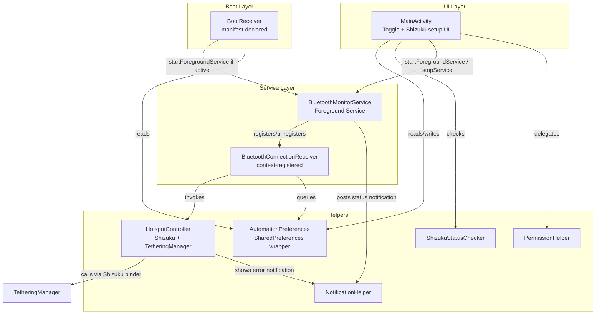
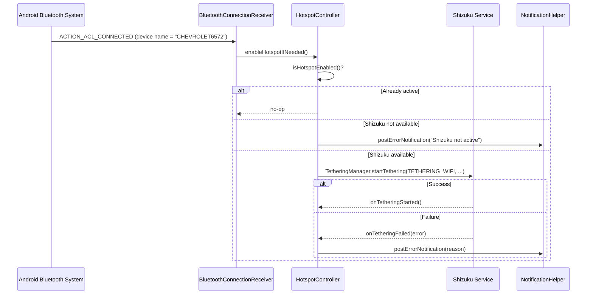

# Design Document: Bluetooth Hotspot Enabler

## Overview

The Bluetooth Hotspot Enabler is a single-screen Android application that automates enabling the device's WiFi hotspot whenever the phone connects via Bluetooth to the hardcoded car head unit named "CHEVROLET6572". The user controls the automation through a simple toggle; the background behavior persists across app close, process kill, and device reboot.

Hotspot control is implemented exclusively via **Shizuku**, which grants the app ADB-level privileges to call `TetheringManager.startTethering()` — the only viable programmatic hotspot API on Android 16+ (API 36+) for non-system apps without root.

### Research Findings

**Why Shizuku:**
Android's `TetheringManager.startTethering()` requires the `TETHER_PRIVILEGED` permission, which is restricted to system/signature apps. All reflection-based workarounds were fully blocked in Android 16 (API 36). Shizuku is an open-source service ([shizuku.rikka.app](https://shizuku.rikka.app)) that runs a privileged Java process with ADB-level identity via `app_process`, and exposes system APIs to authorised apps over Binder. When activated via Android's built-in Wireless Debugging (no computer required on Android 11+), it grants exactly the permissions needed to call `TetheringManager.startTethering()` with `TETHERING_WIFI`.

**Shizuku lifecycle constraint:** On non-rooted devices, Shizuku does not survive device reboot automatically. The user must re-activate it after each reboot via the Shizuku app (one tap on the persistent notification). This is an inherent platform limitation, not a design defect.

**Shizuku dependency (API version):** The Shizuku API library is `dev.rikka.shizuku:api:13.1.5` and `dev.rikka.shizuku:provider:13.1.5`. Both are available from Maven Central.

**Bluetooth broadcast reception:** `BluetoothDevice.ACTION_ACL_CONNECTED` is not in Android's implicit broadcast exception list. On API 26+, a manifest-declared `BroadcastReceiver` cannot receive it unless the app is running a foreground service. The receiver must be registered dynamically via `Context.registerReceiver()` inside the foreground service.

**Foreground service type (API 34+):** Android 14+ requires a declared `foregroundServiceType`. The correct type for Bluetooth interaction is `connectedDevice`, requiring `FOREGROUND_SERVICE_CONNECTED_DEVICE` in the manifest.

**Boot receiver:** `ACTION_BOOT_COMPLETED` is exempt from the implicit broadcast restriction and can be manifest-declared.

---

## Architecture

The app has three layers: a single Activity for UI (including Shizuku setup guidance), a Foreground Service for background Bluetooth monitoring, and helper classes for Shizuku/hotspot control, preferences, permissions, and notifications.



**Core trigger data flow:**



---

## Components and Interfaces

### MainActivity

The single Activity. Responsibilities:
- Display the `AutomationToggle` (`SwitchMaterial`).
- On resume: read persisted toggle state from `AutomationPreferences`; check Shizuku status via `ShizukuStatusChecker` and show setup UI if not ready.
- On toggle → on: validate Shizuku is ready; if not, show setup instructions and revert toggle; if yes, persist state and start `BluetoothMonitorService`.
- On toggle → off: persist state and stop `BluetoothMonitorService`.
- Display inline Shizuku status banner: "Shizuku is active ✓" or "Shizuku not active — tap here to set up".
- Show inline error if `AutomationPreferences` throws.

```kotlin
interface AutomationPreferences {
    /** Returns persisted automation state. Returns false on read failure. */
    fun isAutomationEnabled(): Boolean

    /** Persists automation state. Throws AutomationPrefsException on failure. */
    fun setAutomationEnabled(enabled: Boolean)
}

class AutomationPrefsException(message: String, cause: Throwable?) : Exception(message, cause)
```

**Shizuku setup UI:** When Shizuku is not installed or not active, the main screen shows a dismissible banner with:
- If not installed: "Shizuku is not installed. Tap to open Play Store." → deep-links to Play Store listing.
- If installed but not active: "Shizuku needs to be started. Open Shizuku app to activate it." → launches Shizuku app via intent. Short plain-text instructions explain the one-time Wireless Debugging activation flow.

The `AutomationToggle` is disabled and non-interactive while Shizuku is not active.

### BluetoothMonitorService

An Android `Service` subclass declared with `foregroundServiceType="connectedDevice"`. Responsibilities:
- Start as a foreground service, posting a "Monitoring" status notification.
- Register `BluetoothConnectionReceiver` dynamically on start.
- Unregister receiver on stop; update notification to "Stopped".
- Return `START_STICKY` from `onStartCommand` for auto-restart after process kill.

```kotlin
object ServiceActions {
    const val ACTION_START = "com.example.bthotspot.START"
    const val ACTION_STOP  = "com.example.bthotspot.STOP"
}
```

### BluetoothConnectionReceiver

A `BroadcastReceiver` registered dynamically by `BluetoothMonitorService`. Responsibilities:
- Listen for `BluetoothDevice.ACTION_ACL_CONNECTED`.
- Extract `BluetoothDevice.name` from the intent extra.
- If name equals `"CHEVROLET6572"` and automation is active, call `HotspotController.enableHotspotIfNeeded()`.
- Otherwise take no action.

### BootReceiver

Manifest-declared `BroadcastReceiver` for `ACTION_BOOT_COMPLETED`. Responsibilities:
- Read `AutomationPreferences.isAutomationEnabled()`.
- If true, start `BluetoothMonitorService` via `startForegroundService`.
- Note: Shizuku will also need re-activation after reboot. If Shizuku is not yet active when `CHEVROLET6572` connects post-boot, `HotspotController` will post a notification prompting re-activation.

### HotspotController

The sole hotspot mechanism — Shizuku + `TetheringManager`. No reflection fallback.

```kotlin
interface HotspotController {
    /**
     * Enables WiFi hotspot if not already active.
     * Posts a notification on any failure rather than throwing.
     */
    fun enableHotspotIfNeeded()

    /** Returns true if the WiFi hotspot tethering is currently active. */
    fun isHotspotEnabled(): Boolean
}
```

**Implementation:**

`HotspotControllerImpl` uses the Shizuku API to obtain a `TetheringManager` instance with ADB-level privileges and calls `startTethering()`:

```kotlin
// Obtain privileged TetheringManager via Shizuku binder
val tetheringManager = ShizukuBinderWrapper.wrap(
    context.getSystemService(Context.TETHERING_SERVICE) as TetheringManager
)

val request = TetheringManager.TetheringRequest.Builder(TetheringManager.TETHERING_WIFI).build()

tetheringManager.startTethering(
    request,
    Executors.newSingleThreadExecutor(),
    object : TetheringManager.StartTetheringCallback {
        override fun onTetheringStarted() { /* success — no action needed */ }
        override fun onTetheringFailed(error: Int) {
            notificationHelper.postErrorNotification(
                title = "Hotspot could not be enabled",
                body  = "Error code: $error"
            )
        }
    }
)
```

`isHotspotEnabled()` checks `WifiManager.isWifiApEnabled()` (public API, no privilege needed).

**Guard checks before calling `startTethering`:**
1. `Shizuku.pingBinder()` — confirms Shizuku process is alive.
2. `Shizuku.checkSelfPermission()` — confirms our app has been granted Shizuku permission by the user.
3. `isHotspotEnabled()` — skips if already active.

If any guard fails, `HotspotController` posts an appropriate notification (see Error Handling table).

### ShizukuStatusChecker

```kotlin
interface ShizukuStatusChecker {
    /** Returns true if Shizuku is installed on the device. */
    fun isInstalled(): Boolean

    /** Returns true if the Shizuku service is running and reachable. */
    fun isRunning(): Boolean

    /** Returns true if this app has been granted Shizuku permission. */
    fun hasPermission(): Boolean

    /** Requests Shizuku permission from the user (shows Shizuku's permission dialog). */
    fun requestPermission(requestCode: Int)
}
```

`isInstalled()` checks for the `moe.shizuku.privileged.api` package via `PackageManager`.
`isRunning()` calls `Shizuku.pingBinder()`.
`hasPermission()` calls `Shizuku.checkSelfPermission() == PackageManager.PERMISSION_GRANTED`.

### PermissionHelper

```kotlin
interface PermissionHelper {
    /** Returns BLUETOOTH_CONNECT on API 31+, BLUETOOTH below. */
    fun requiredBluetoothPermission(): String

    /** Returns true if all required Android runtime permissions are granted. */
    fun hasAllPermissions(context: Context): Boolean

    /**
     * Builds a denial message containing:
     * (a) permission name, (b) functionality description, (c) settings navigation hint.
     */
    fun buildDenialMessage(permission: String): String
}
```

Required runtime permissions: `BLUETOOTH_CONNECT` (API 31+) or `BLUETOOTH` (older), plus `POST_NOTIFICATIONS` (API 33+) for error notifications.

Note: `WRITE_SETTINGS` is no longer required — Shizuku replaces that entire permission flow.

### NotificationHelper

```kotlin
interface NotificationHelper {
    /** Builds the foreground service persistent notification. */
    fun buildServiceNotification(isMonitoring: Boolean): Notification

    /** Posts a one-shot error/status notification. */
    fun postErrorNotification(title: String, body: String)
}
```

Two notification channels:
- `CHANNEL_SERVICE` — low importance, persistent foreground service status.
- `CHANNEL_ERRORS` — default importance, for failure and Shizuku alerts.

---

## Data Models

### AutomationState (persisted)

Stored in `SharedPreferences`. Single key:

| Key | Type | Default | Description |
|---|---|---|---|
| `automation_enabled` | Boolean | false | Whether the automation is active |

### Notification Content

```kotlin
data class ServiceNotificationContent(
    val appName: String,     // "Bluetooth Hotspot Enabler"
    val statusText: String   // "Monitoring" | "Stopped"
)
```

---

## Manifest Permissions Summary

```xml
<!-- Bluetooth -->
<uses-permission android:name="android.permission.BLUETOOTH_CONNECT" />  <!-- API 31+ -->
<uses-permission android:name="android.permission.BLUETOOTH"
    android:maxSdkVersion="30" />

<!-- Foreground service -->
<uses-permission android:name="android.permission.FOREGROUND_SERVICE" />
<uses-permission android:name="android.permission.FOREGROUND_SERVICE_CONNECTED_DEVICE" />

<!-- Boot -->
<uses-permission android:name="android.permission.RECEIVE_BOOT_COMPLETED" />

<!-- Notifications (API 33+) -->
<uses-permission android:name="android.permission.POST_NOTIFICATIONS" />

<!-- Shizuku -->
<uses-permission android:name="moe.shizuku.manager.permission.API_V23" />
```

No `WRITE_SETTINGS` needed — Shizuku handles privilege escalation.

---

## Correctness Properties

### Property 1: Automation state persistence round-trip

*For any* boolean value written to `AutomationPreferences`, reading it back must return the same value.

**Validates: Requirements 1.4**

### Property 2: Non-target device name triggers no action

*For any* Bluetooth device name not equal to `"CHEVROLET6572"`, with automation active, `HotspotController.enableHotspotIfNeeded()` must not be called.

**Validates: Requirements 2.4**

### Property 3: Inactive automation suppresses all events

*For any* Bluetooth device name (including `"CHEVROLET6572"`), with automation inactive, `HotspotController.enableHotspotIfNeeded()` must not be called.

**Validates: Requirements 2.5**

### Property 4: Permission denial message completeness

*For any* permission in `{BLUETOOTH_CONNECT, BLUETOOTH}`, `PermissionHelper.buildDenialMessage()` must return a string containing (a) the permission name, (b) a functionality description, and (c) the word "Settings" or a settings URI.

**Validates: Requirements 4.3**

### Property 5: Notification status correctness

*For any* boolean monitoring state, `NotificationHelper.buildServiceNotification(isMonitoring)` must include the app name and display `"Monitoring"` when true, `"Stopped"` when false.

**Validates: Requirements 5.2**

---

## Error Handling

| Scenario | Handler | User feedback |
|---|---|---|
| Shizuku not installed | `ShizukuStatusChecker` in `MainActivity` | Inline banner with Play Store link; toggle disabled |
| Shizuku not active (post-reboot or not started) | `ShizukuStatusChecker` in `MainActivity` | Inline banner with link to open Shizuku app; toggle disabled |
| Shizuku permission not granted by user | `ShizukuStatusChecker` in `MainActivity` | Permission dialog shown via `Shizuku.requestPermission()` |
| Shizuku not active when BT connects (background) | `HotspotController` guard check | `CHANNEL_ERRORS` notification: "Shizuku is not active. Open Shizuku to re-activate." |
| `TetheringManager.startTethering()` returns failure | `onTetheringFailed(error)` callback | `CHANNEL_ERRORS` notification with error code |
| Hotspot already enabled | `isHotspotEnabled()` guard | No-op, no notification |
| `SharedPreferences` read fails | Returns `false`, caught in `MainActivity` | Inline error message |
| `SharedPreferences` write fails | Throws `AutomationPrefsException` | Inline error message |
| Bluetooth permission denied | `PermissionHelper` + `MainActivity` | Inline message: permission name + purpose + settings link |
| Bluetooth permission permanently denied | `shouldShowRequestPermissionRationale` = false | Settings deep-link; no re-request dialog |
| `startForegroundService` throws `SecurityException` | Caught in `MainActivity` | Inline error; user prompted to check app permissions |

---

## Testing Strategy

### Property-Based Tests (Kotest)

Use **Kotest** with `kotest-property`. Minimum 100 iterations per property. Tag format: `Feature: bluetooth-hotspot-enabler, Property N: <title>`.

**Property 1 — Persistence round-trip**
- `Arb.boolean()` → write to in-memory `AutomationPreferences` mock → read back → assert equal.

**Property 2 — Non-target device name triggers no action**
- `Arb.string()` filtered to exclude `"CHEVROLET6572"` → call `onDeviceConnected(name)` with automation active → assert `enableHotspotIfNeeded()` never called (MockK `verify(exactly = 0)`).

**Property 3 — Inactive automation suppresses all events**
- `Arb.string()` (all names including `"CHEVROLET6572"`) → automation inactive → assert `enableHotspotIfNeeded()` never called.

**Property 4 — Permission denial message completeness**
- `Arb.element(BLUETOOTH_CONNECT, BLUETOOTH)` → `buildDenialMessage(permission)` → assert contains permission name, non-empty description, "Settings".

**Property 5 — Notification status correctness**
- `Arb.boolean()` → `buildServiceNotification(isMonitoring)` → assert contains app name; text = `"Monitoring"` or `"Stopped"`.

### Unit Tests (JUnit 5 + MockK)

- `MainActivity` defaults toggle to off on first launch
- `MainActivity` shows inline error on prefs write failure
- Toggle on/off never calls `HotspotController`
- `BluetoothConnectionReceiver` calls `enableHotspotIfNeeded()` only for `"CHEVROLET6572"`
- `HotspotController` is no-op if `isHotspotEnabled()` returns true
- `HotspotController` posts Shizuku-not-active notification when `pingBinder()` fails
- `HotspotController` posts failure notification when `onTetheringFailed()` fires
- `ShizukuStatusChecker.isInstalled()` returns false when package absent
- `BootReceiver` starts service when automation was active
- Toggle is disabled when `ShizukuStatusChecker.isRunning()` returns false

### Integration Tests (AndroidX Test + Espresso)

- Foreground service persists after `Activity.finish()`
- Service restarts within 10 seconds after process kill
- Boot receiver starts service within 30 seconds of `BOOT_COMPLETED` broadcast
- Toggle on starts service within 2 seconds; toggle off stops it
- End-to-end: fake `ACTION_ACL_CONNECTED` broadcast with name `"CHEVROLET6572"` triggers `startTethering()` call on a device with Shizuku active

### What is deliberately not property-tested

- Shizuku binder invocation itself — platform/IPC behaviour, not our logic; covered by integration tests.
- Boot lifecycle timing — deterministic integration test with a measured timeout.
- UI layout — Espresso example tests.
